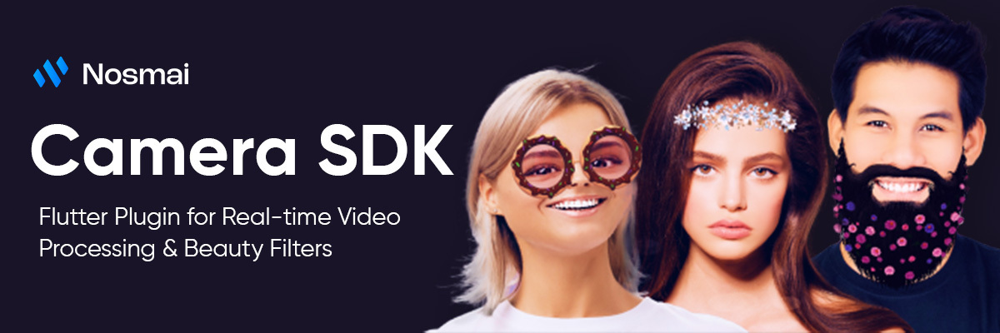

# Nosmai Camera SDK Flutter Plugin

A Flutter plugin for integrating the Nosmai SDK - Real-time video filtering and beauty effects for mobile applications.

## Features

- 🎥 Real-time video processing with camera preview
- ✨ Beauty filters (skin smoothing, whitening, face slimming)
- 🎨 Color adjustments (brightness, contrast, RGB)
- 🎭 Effects and filters with .nosmai file support
- 📱 Camera controls (front/back switching, photo capture, video recording)
- 💾 Save photos and videos to gallery

## Platform Support

| Platform | Status |
|----------|--------|
| iOS      | ✅ Supported (iOS 14.0+) |
| Android  | ✅ Supported (API 21+) |

## ⚠️ Breaking Changes (v3.0.0+)

**Filter Structure Updated for Better Performance**

The old `assets/filters/` structure has been **deprecated** and replaced with a new organized structure to improve performance and maintainability.

### Migration Required

❌ **Old Structure (Deprecated):**
```
assets/filters/
  └── filter_name.nosmai
```

✅ **New Structure (Required):**
```
assets/nosmai_filters/
  └── {filter_name}/
      ├── {filter_name}_manifest.json
      ├── {filter_name}_preview.png
      └── {filter_name}.nosmai
```

### Action Items:

1. **Remove old filters** from `assets/filters/` directory
2. **Download new filters** from [Nosmai Assets Store](https://effects.nosmai.com/assets-store/filters)
3. **Update `pubspec.yaml`** - Each filter needs individual path declaration:

```yaml
flutter:
  assets:
    - assets/nosmai_filters/color_invert/
    - assets/nosmai_filters/khaby_lame/
    - assets/nosmai_filters/your_filter_name/
```

> **Note:** See [example/pubspec.yaml](example/pubspec.yaml) for reference implementation.

## Installation

Add this to your package's `pubspec.yaml` file:

```yaml
dependencies:
  nosmai_camera_sdk: ^3.0.3
```

## Setup

### iOS Setup

1. **Update `ios/Podfile`**:
```ruby
platform :ios, '14.0'

target 'Runner' do
  use_frameworks! :linkage => :static
  use_modular_headers!
  
  flutter_install_all_ios_pods(File.dirname(File.realpath(__FILE__)))
end
```

2. **Add permissions to `ios/Runner/Info.plist`**:
```xml
<key>NSCameraUsageDescription</key>
<string>This app uses the camera to apply real-time filters.</string>
<key>NSMicrophoneUsageDescription</key>
<string>This app uses the microphone for video recording.</string>
<key>NSPhotoLibraryUsageDescription</key>
<string>This app saves photos and videos to your gallery.</string>
<key>NSPhotoLibraryAddUsageDescription</key>
<string>This app saves photos and videos to your gallery.</string>
```


### Android Setup

1. **Download AAR file**:
   - Download `nosmai-release.aar` from [latest release](https://github.com/nosmai/nosmai_camera_sdk_flutter/releases/latest)
   - Place in `android/app/libs/nosmai-release.aar`

2. **Update `android/build.gradle`**:
```gradle
allprojects {
  repositories {
    google()
    mavenCentral()
    flatDir { dirs "${rootProject.projectDir}/app/libs" }
  }
}
```

3. **Update `android/app/build.gradle`**:
```gradle
dependencies {
  implementation files('libs/nosmai-release.aar')
}
```

4. **Add permissions to `android/app/src/main/AndroidManifest.xml`**:
```xml
<uses-permission android:name="android.permission.CAMERA"/>
<uses-permission android:name="android.permission.RECORD_AUDIO"/>
<uses-permission android:name="android.permission.INTERNET"/>
<uses-permission android:name="android.permission.READ_EXTERNAL_STORAGE"/>
```

## Basic Usage

### Initialize SDK
```dart
import 'package:nosmai_camera_sdk/nosmai_camera_sdk.dart';

// Initialize in main()
await NosmaiFlutter.initialize('YOUR_LICENSE_KEY');
```

### Camera Preview
```dart
class CameraScreen extends StatelessWidget {
  @override
  Widget build(BuildContext context) {
    return Scaffold(
      body: NosmaiCameraPreview(),
    );
  }
}
```

### Basic Controls
```dart
final nosmai = NosmaiFlutter.instance;

// Switch camera
await nosmai.switchCamera();

// Capture photo
final result = await nosmai.capturePhoto();
if (result.success) {
  await nosmai.saveImageToGallery(result.imageData!);
}

// Start/stop recording
await nosmai.startRecording();
final recordResult = await nosmai.stopRecording();
if (recordResult.success) {
  await nosmai.saveVideoToGallery(recordResult.videoPath!);
}
```

## API Documentation

For detailed API documentation, filter examples, and advanced usage, visit our website: [https://effects.nosmai.com/platforms/flutter/overview](https://effects.nosmai.com/platforms/flutter/overview)


## Support

- Plugin issues: [GitHub Issues](https://github.com/nosmai/nosmai_camera_sdk_flutter/issues)
- SDK documentation: [https://docs-sdk.nosmai.com](https://docs-sdk.nosmai.com/)
- License support: Contact Nosmai team

## License Registration

To use the Nosmai SDK, you need to register and get a license key from:
**[https://effects.nosmai.com/](https://effects.nosmai.com/)**

## License

MIT License. Nosmai SDK usage requires separate licensing.